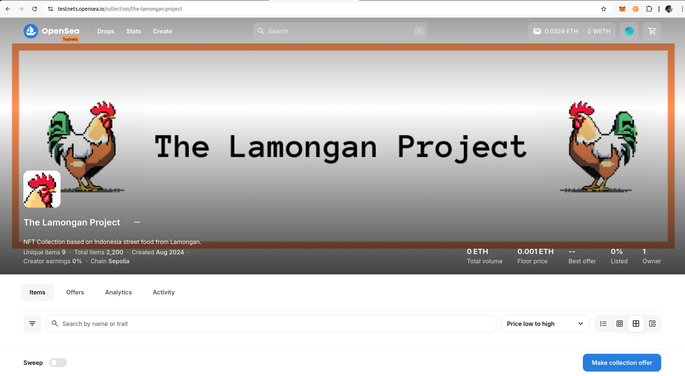
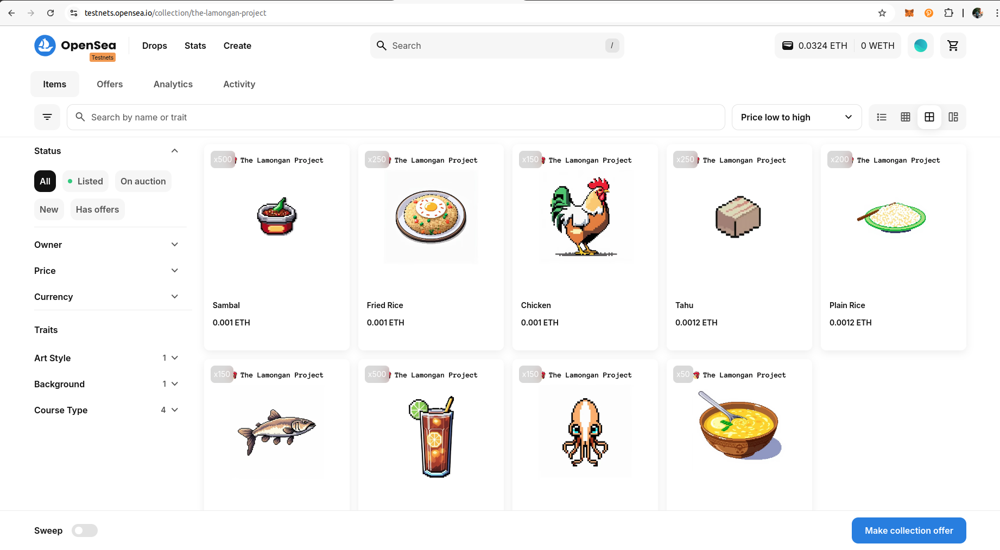
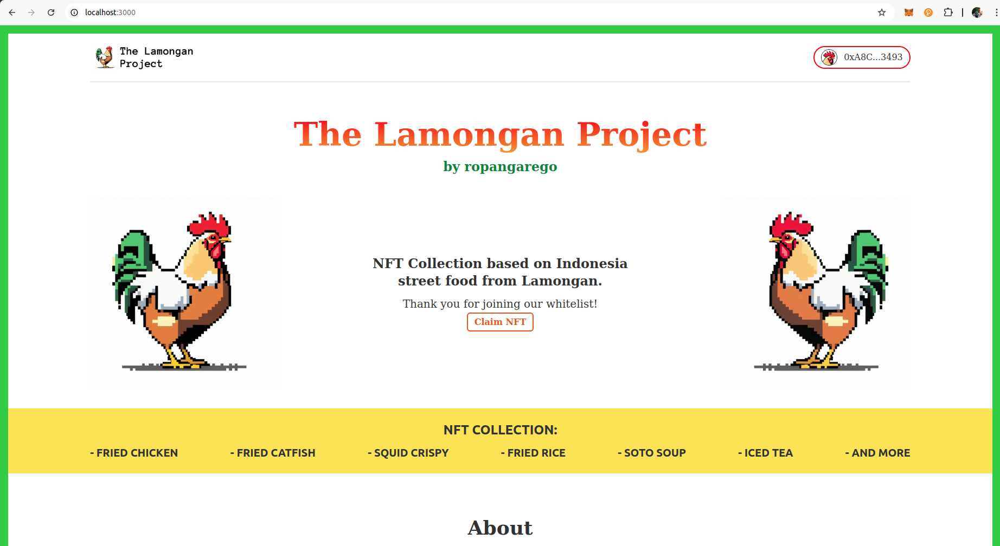
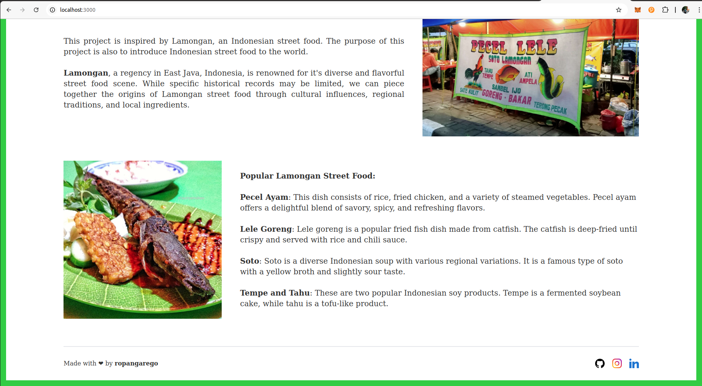

# The Lamongan Project

This project is inspired by Lamongan, an Indonesian street food. The purpose of this project is also to introduce Indonesian street food to the world. The project includes the whitelist smart contract also the frontend, NFTs (ERC1155) and LAMO Token (ERC20).

Lamongan, a regency in East Java, Indonesia, is renowned for it's diverse and flavorful street food scene. While specific historical records may be limited, we can piece together the origins of Lamongan street food through cultural influences, regional traditions, and local ingredients.

Check out the smart contract on Etherscan and OpenSea for the NFTs:

- <a href="https://sepolia.etherscan.io/token/0x6d382e0d2582885cf1b311640783c3cbf49359ae">LAMO (ERC20) Smart Contract - Etherscan (testnet)</a>
- <a href="https://sepolia.etherscan.io/address/0xd6a2c6e2268a07c8e1196b96b1a45c9011db2e23">LAMO (ERC1155) Smart Contract - Etherscan (testnet)</a>
- <a href="https://testnets.opensea.io/collection/the-lamongan-project">The Lamongan NFTs - OpenSea (testnet)</a>
- <a href="https://sepolia.etherscan.io/address/0x5a6ca0259a0b5b891bcd149de5bcec494d55e6dc">Whitelist Smart Contract - Etherscan (testnet)</a>

 

# Preview

## NFTs on OpenSea

 

## Whitelist Frontend

